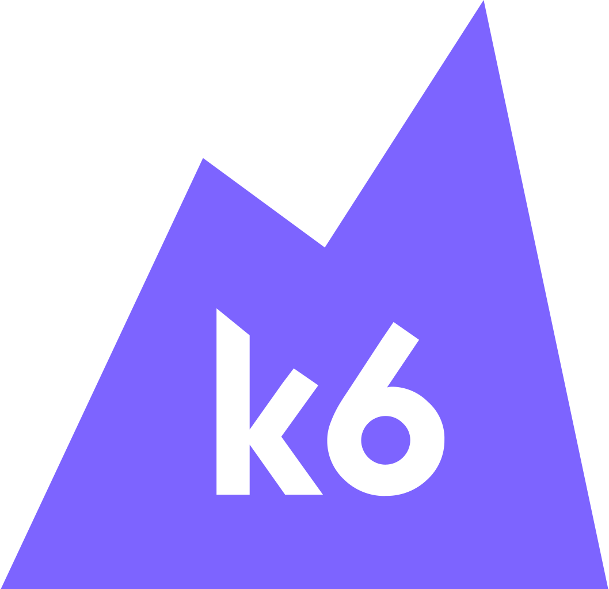

<p align="center">
  
</p>

<h3 align="center">CROSS City Cloud Performance and Load Tests</h3>
<h4 align="center">k6 performance and load testing modules</h4>

---

## Table of Contents

- [Build, Bundle and Run the Tests](#build,-bundle-and-run-the-tests)
    - [Prerequisites](#prerequisites)
    - [Build and Bundle](#build-and-bundle)
    - [Run a Test](#run-a-test)
- [Benchmark Environment](#benchmark-environment)
    - [Build and Push Docker Image](#build-and-push-docker-image)
    - [Run Pod in Kubernetes Cluster](#run-pod-in-kubernetes-cluster)  
- [Produce JS Static Files from Protos](#produce-js-static-files-from-protos)
- [Authors](#authors)

## Build, Bundle and Run the Tests

### Prerequisites

- NodeJS >= 10.19.0
- npm >= 6.14.4
- k6 >= 0.38.3

### Build and Bundle

In the root of the project:

```shell script
npm run bundle
```

The "dist" directory containing the scripts sufixed by bundle.js should be created.

### Run a Test

As an execution example of the "trip.bundle.js", from the root of the project:

```shell script
k6 run dist/trip.bundle.js
```

## Benchmark Environment

### Build and Push Docker Image

From the root of the project:

```shell script
docker build -t k6-cross .
```

Tag with version and push to container registry: 

```shell script
docker tag k6-cross gcr.io/gsdsupport/k6-cross:v1.0.0
```

```shell script
gcloud docker -- push gcr.io/gsdsupport/k6-cross:v1.0.0
```

### Run Pod in Kubernetes Cluster

Execution example of a single pod running the trip.bundle.js test script:

(Note the output to InfluxDB for the visualization in Grafana, assuming the service name "main-influxdb" and the database "k6db)

```shell script
kubectl run k6-cross --image=gcr.io/gsdsupport/k6-cross:v1.0.9 -- run --out influxdb=http://main-influxdb:8086/k6db /dist/trip.bundle.js
```

## Produce JS Static Files from Protos

```shell script
protoc --js_out=import_style=commonjs,binary:. [PATH-TO-PROTOS]
```

## Authors

| Name              | University                 | More info                                                                                                                                                                                                                                                                                                                                                                                       |
|-------------------|----------------------------|-------------------------------------------------------------------------------------------------------------------------------------------------------------------------------------------------------------------------------------------------------------------------------------------------------------------------------------------------------------------------------------------------|
| Lucas Vicente     | Instituto Superior Técnico | [](mailto:lucasdhvicente@gmail.com "lucasdhvicente@gmail.com") [](https://github.com/WARSKELETON "WARSKELETON") [](https://www.linkedin.com/in/lucas-vicente-a91819184/ "lucas-vicente-a91819184") |
